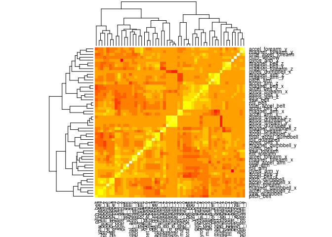

# Practical Machine Learning Prediction Assignment

## Synopsis  
  
Using devices such as Jawbone Up, Nike FuelBand, and Fitbit it is now possible to collect a large amount of data about personal activity relatively inexpensively. These type of devices are part of the quantified self movement – a group of enthusiasts who take measurements about themselves regularly to improve their health, to find patterns in their behavior, or because they are tech geeks.  

One thing that people regularly do is quantify how much of a particular activity they do, but they rarely quantify how well they do it. In this project, we will use data from accelerometers on the belt, forearm, arm, and dumbell of 6 participants. They were asked to perform barbell lifts correctly and incorrectly in 5 different ways.  

The goal of this report is to predict the manner in which the participants did the exercise, this is the "classe" variable in the training set. This report describes how the model for the project was built, its cross validation, expected out of sample error calculation, and the choices made.  

## Data Processing  
First we set the seed for our report, then download and read in the test and training data sets.  


```r
## Set the seed to allow for reproducibility
set.seed(11132009)

if(!file.exists("training-set.csv")){
    trainURL <- "https://d396qusza40orc.cloudfront.net/predmachlearn/pml-training.csv"
    download.file(trainURL, "training-set.csv", method="curl")
}

if(!file.exists("testing-set.csv")){
    testURL <- "https://d396qusza40orc.cloudfront.net/predmachlearn/pml-testing.csv"
    download.file(testURL, "testing-set.csv", method="curl")
}

training <- read.csv("training-set.csv", na.strings = c("NA", "#DIV/0!", ""))
testing  <- read.csv("testing-set.csv",  na.strings = c("NA", "#DIV/0!", ""))
```
  
We do some basic evaluations of the training set to get an understanding of the data. In particular we look at the "classe" column.  


```r
str(training, list.len=15)
```

```
## 'data.frame':	19622 obs. of  160 variables:
##  $ X                       : int  1 2 3 4 5 6 7 8 9 10 ...
##  $ user_name               : Factor w/ 6 levels "adelmo","carlitos",..: 2 2 2 2 2 2 2 2 2 2 ...
##  $ raw_timestamp_part_1    : int  1323084231 1323084231 1323084231 1323084232 1323084232 1323084232 1323084232 1323084232 1323084232 1323084232 ...
##  $ raw_timestamp_part_2    : int  788290 808298 820366 120339 196328 304277 368296 440390 484323 484434 ...
##  $ cvtd_timestamp          : Factor w/ 20 levels "02/12/2011 13:32",..: 9 9 9 9 9 9 9 9 9 9 ...
##  $ new_window              : Factor w/ 2 levels "no","yes": 1 1 1 1 1 1 1 1 1 1 ...
##  $ num_window              : int  11 11 11 12 12 12 12 12 12 12 ...
##  $ roll_belt               : num  1.41 1.41 1.42 1.48 1.48 1.45 1.42 1.42 1.43 1.45 ...
##  $ pitch_belt              : num  8.07 8.07 8.07 8.05 8.07 8.06 8.09 8.13 8.16 8.17 ...
##  $ yaw_belt                : num  -94.4 -94.4 -94.4 -94.4 -94.4 -94.4 -94.4 -94.4 -94.4 -94.4 ...
##  $ total_accel_belt        : int  3 3 3 3 3 3 3 3 3 3 ...
##  $ kurtosis_roll_belt      : num  NA NA NA NA NA NA NA NA NA NA ...
##  $ kurtosis_picth_belt     : num  NA NA NA NA NA NA NA NA NA NA ...
##  $ kurtosis_yaw_belt       : logi  NA NA NA NA NA NA ...
##  $ skewness_roll_belt      : num  NA NA NA NA NA NA NA NA NA NA ...
##   [list output truncated]
```

```r
table(training$classe)
```

```
## 
##    A    B    C    D    E 
## 5580 3797 3422 3216 3607
```

```r
prop.table(table(training$classe))
```

```
## 
##         A         B         C         D         E 
## 0.2843747 0.1935073 0.1743961 0.1638977 0.1838243
```

Based on the above information we see that the first 6 columns are general information and can be removed for both the testing and training data sets. We also go ahead and remove the columns that are mostly NA's at this time.  


```r
training <- training[, 7:160]
testing  <- testing[, 7:160]
dim(training)
```

```
## [1] 19622   154
```

```r
dim(testing)
```

```
## [1]  20 154
```

```r
no.na  <- apply(!is.na(training), 2, sum) > 19621
training <- training[, no.na]
testing  <- testing[, no.na]
dim(training)
```

```
## [1] 19622    54
```

```r
dim(testing)
```

```
## [1] 20 54
```
At this point we should also eliminate predictors with a near zero variance, but a call to nearZeroVar on the training set returns zero rows, which means that all our current predictors have a significant variance and do not need to be removed.  

We now go ahead and separate our training data set into two for cross validation purposes.  


```r
library(caret)

inTrain <- createDataPartition(y=training$classe, p=0.60, list=FALSE)
train1  <- training[inTrain,]
train2  <- training[-inTrain,]
dim(train1)
```

```
## [1] 11776    54
```

```r
dim(train2)
```

```
## [1] 7846   54
```

## Results  

We check for correlation between the predictors using heatmap for a visualization.  

```r
train1Cor <- cor(train1[, names(train1) != "classe"])
heatmap(train1Cor)
```

 
  
Based on the above coloring we can see that there are some correlations, but overrall the correlations are not high and will be within parameters for our predictive model.  

We attempt to narrow down our covariates even further using PCA to reduce the number of predictors.   


```r
PCAmodel <- preProcess(train1[,-54], method="pca", thresh=0.90)
train1PCA <- predict(PCAmodel, train1[,-54])
train2PCA <- predict(PCAmodel, train2[,-54])

train1PCA$classe <- train1$classe
train2PCA$classe <- train2$classe
```

This reduces our predictors to 19 which will make the training time much shorter.  
  
We can now build our model based off our train1PCA data set. We will be using Random Forest for our method as it is tolerant to non-linearity and some correlation.  

```r
tc <- trainControl(method = "cv", number = 4, allowParallel = TRUE)

model <- train(classe ~ ., data = train1PCA, method = "rf", trControl = tc)
```

We then check the model and calculate the prediction accuracy.

```r
model
```

```
## Random Forest 
## 
## 11776 samples
##    19 predictors
##     5 classes: 'A', 'B', 'C', 'D', 'E' 
## 
## No pre-processing
## Resampling: Cross-Validated (4 fold) 
## 
## Summary of sample sizes: 8833, 8832, 8831, 8832 
## 
## Resampling results across tuning parameters:
## 
##   mtry  Accuracy   Kappa      Accuracy SD  Kappa SD   
##    2    0.9598340  0.9491958  0.006376314  0.008069083
##   10    0.9532945  0.9409207  0.007800658  0.009850856
##   19    0.9474348  0.9335195  0.006550646  0.008248201
## 
## Accuracy was used to select the optimal model using  the largest value.
## The final value used for the model was mtry = 2.
```

```r
trainingAccuracy <- round(max(model$results$Accuracy), 4) * 100
trainingAccuracy
```

```
## [1] 95.98
```

Lastly, we cross-validate training with the train2 sub-sampling we split from the data set.

```r
prediction.training <- predict(model, train2PCA)

matrix <- confusionMatrix(prediction.training, train2PCA$classe)
matrix
```

```
## Confusion Matrix and Statistics
## 
##           Reference
## Prediction    A    B    C    D    E
##          A 2204   30    6    4    0
##          B    8 1458   24    4    3
##          C    9   20 1314   60    2
##          D    9    7   18 1215   12
##          E    2    3    6    3 1425
## 
## Overall Statistics
##                                           
##                Accuracy : 0.9707          
##                  95% CI : (0.9667, 0.9743)
##     No Information Rate : 0.2845          
##     P-Value [Acc > NIR] : < 2.2e-16       
##                                           
##                   Kappa : 0.9629          
##  Mcnemar's Test P-Value : 5.121e-07       
## 
## Statistics by Class:
## 
##                      Class: A Class: B Class: C Class: D Class: E
## Sensitivity            0.9875   0.9605   0.9605   0.9448   0.9882
## Specificity            0.9929   0.9938   0.9860   0.9930   0.9978
## Pos Pred Value         0.9822   0.9739   0.9352   0.9635   0.9903
## Neg Pred Value         0.9950   0.9905   0.9916   0.9892   0.9973
## Prevalence             0.2845   0.1935   0.1744   0.1639   0.1838
## Detection Rate         0.2809   0.1858   0.1675   0.1549   0.1816
## Detection Prevalence   0.2860   0.1908   0.1791   0.1607   0.1834
## Balanced Accuracy      0.9902   0.9772   0.9732   0.9689   0.9930
```

Based on the matrix is appears the overall accuracy we achieved was 97.2%. This would mean that our out of sample error was 2.8%.  


